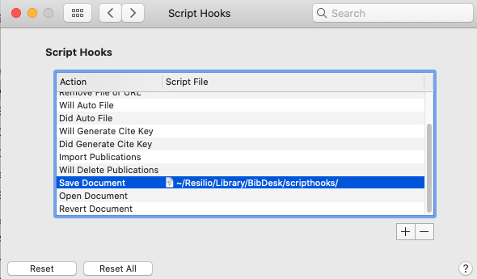

## export_groups.scpt

`export_group.scpt` is a sample AppleScript which you may use for the `BibDesk`  'Save Document' script hook function (see the screenshot below).
With a little bit of customization, the script can help automatically export BibTeX entries from certain static groups into individual `.bib` files at specified locations. 

If you maintain a master `.bib` file and have a habit of assigning articles into project/topic-specific groups, this 'scripthook' workflow will always give you smaller up-to-date `.bib` files in different working directories. Each file will only contain a subset of relevant `BibTeX` entries.

_

## Reference:

[BibDesk Help: 12.3.2 Script Hook Sample 2](https://bibdesk.sourceforge.io/manual/BibDeskHelp_84.html)